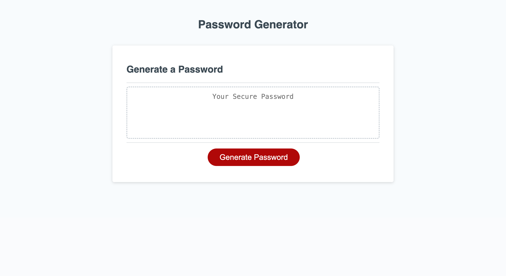

# Password Generator 

## Description

The Password Generator is a dynamic web application designed to improve security for users across the digital landscape. I was motivated by the need to access/secure sensitive data, this tool provides a customizable and secure means of generating passwords. It solves the problem of creating strong, unique passwords that are essential in protecting online data. Building this project deepened my understanding of JavaScript logic and browser-based interactivity.

## Installation

Visit site at https://www.nardgie.github.io/password-generator


## Usage

Use the Password Generator by selecting your criteria for the password and clicking the "Generate" button. Type in your desired password character length as a number between 8 and 128. Confirm which character types to include or not to include in your password. Once finished, your new randomly generated password will appear in the text box area, with your desired length and at least one of each your specified character types.

```md

```

## Credits

This project was independently built by Nardgelen Jean Francois 

## License

MIT License

Copyright (c) 2024 Nardgelen Jean Francois

Permission is hereby granted, free of charge, to any person obtaining a copy
of this software and associated documentation files (the "Software"), to deal
in the Software without restriction, including without limitation the rights
to use, copy, modify, merge, publish, distribute, sublicense, and/or sell
copies of the Software, and to permit persons to whom the Software is
furnished to do so, subject to the following conditions:

The above copyright notice and this permission notice shall be included in all
copies or substantial portions of the Software.

THE SOFTWARE IS PROVIDED "AS IS", WITHOUT WARRANTY OF ANY KIND, EXPRESS OR
IMPLIED, INCLUDING BUT NOT LIMITED TO THE WARRANTIES OF MERCHANTABILITY,
FITNESS FOR A PARTICULAR PURPOSE AND NONINFRINGEMENT. IN NO EVENT SHALL THE
AUTHORS OR COPYRIGHT HOLDERS BE LIABLE FOR ANY CLAIM, DAMAGES OR OTHER
LIABILITY, WHETHER IN AN ACTION OF CONTRACT, TORT OR OTHERWISE, ARISING FROM,
OUT OF OR IN CONNECTION WITH THE SOFTWARE OR THE USE OR OTHER DEALINGS IN THE
SOFTWARE.

___________

## Features

Customizable password length and character types.
